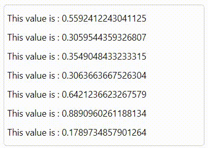

[](https://www.npmjs.com/package/react-scroll-log-text) [](https://standardjs.com)

# react-scroll-log-text

> react js 文字滚动插件, push一条新数据，滚动一次。





[Document](README.en.md)

## 安装

```bash
yarn add react-scroll-log-text // or npm install --save react-scroll-log-text
```

## 使用

```jsx
import React, { Component } from 'react'

import MyComponent from 'react-scroll-log-text'
import 'react-scroll-log-text/dist/index.css'

class Example extends Component {
  render() {
    return <MyComponent />
  }
}
```

## 参数

|字段|描述|类型|默认值|
|---|---|---|---|
| `data` | 数据 | Array or Object | [] |
| `animateSpeed` | 动画滚动过渡时间，单位：秒 | Number | 1 |
| `length` | 大于length条数据开始滚动 | Number | 5 |
| `liStyle` | li标签的sytle (像素必须加单位px) | Object |  |
| `childrenFc` | 自定义渲染item组件，如data为多个字段时 | function |  |

举个例子：[example](example)

## License

MIT © [rfw](https://github.com/rfw)
